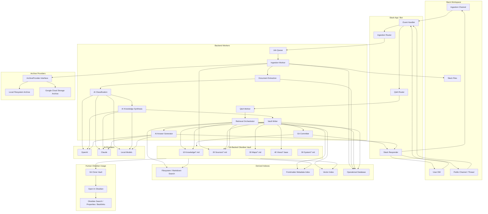
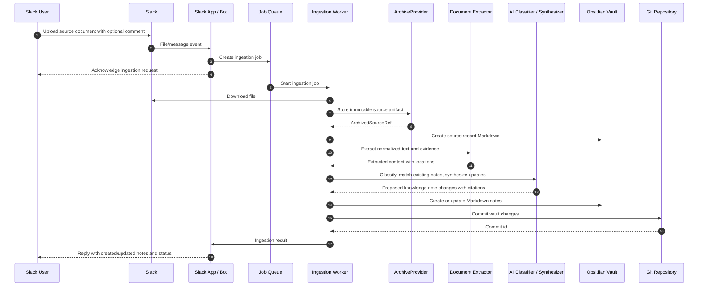
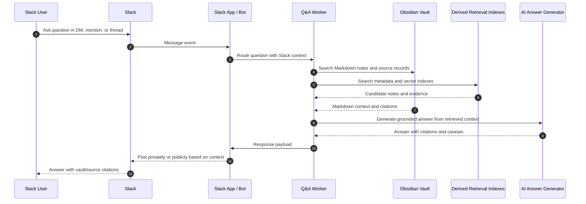
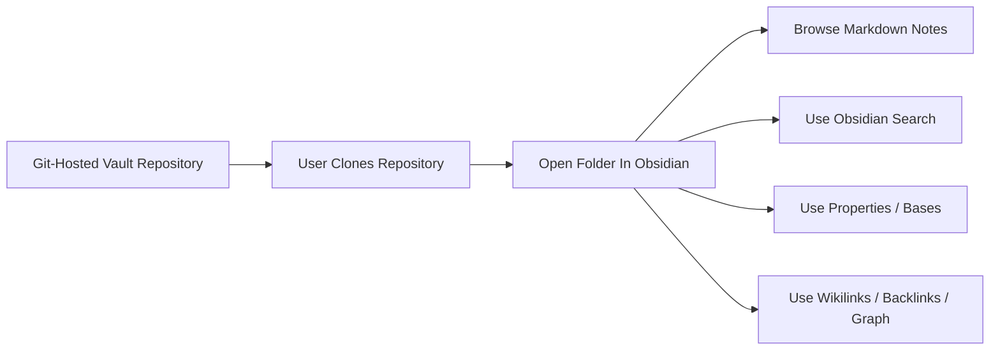

# Architecture Diagrams

This document contains Mermaid diagrams for the Slack Vault architecture.

## Component Architecture

## Ingestion Flow

## Slack Q&A Flow

## Obsidian Clone-And-Use Flow

