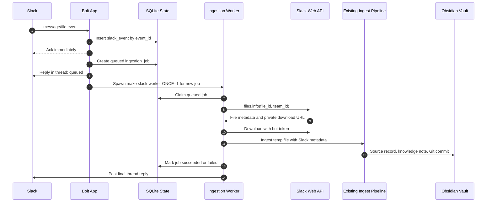

# Slack Integration Plan

This document expands Phase 6 of the implementation plan. It focuses on Slack
ingestion first, while making the app compatible with Slack Enterprise Grid
deployment patterns from the beginning.

## Scope

Phase 6 should connect Slack file uploads to the existing local ingestion
pipeline:

1. Receive a file-upload event from one configured ingestion channel.
2. Acknowledge the Slack event quickly.
3. Record the Slack event and job state in SQLite.
4. Download the file to temporary local storage outside Git.
5. Archive the original file through the configured archive provider.
6. Extract evidence, optionally enhance it, synthesize a knowledge note, write a
   source record, and commit the vault changes.
7. Push committed vault changes upstream when Git push mode is enabled.
8. Reply in the Slack thread with success or failure status.

Slack Q&A remains Phase 7. Vector retrieval, broad multi-workspace routing,
production deployment, Enterprise Search, Audit Logs, and admin automation are
not required for Phase 6.

## Current Status

Status as of 2026-06-15:

- The unit-testable Phase 6 ingestion slice is implemented locally.
- Live Slack setup preflight passes against the configured development app and
  `#slack-vault-dev-ingest` channel when both runtime credentials and setup-time
  app manifest credentials are present. The bot token authenticates, the
  configured team matches, the bot is in the channel, channel history access
  works, `files.info` scope is available, the app token can open a Socket Mode
  connection, and the exported app manifest includes the required Socket Mode,
  bot event, and bot scope configuration.
- The first live Slack file-ingestion smoke test passed against
  `#slack-vault-dev-ingest`: uploading `sample_company_filings_status.md`
  queued ingestion, the worker downloaded the Slack file, archived it, extracted
  six Markdown evidence blocks, synthesized a knowledge note, wrote a source
  record, created vault commit `7a08768 Ingest source-2026-06-15-32f0716c1e53`,
  and posted the Slack result. That live smoke commit was initially created
  locally; Slack ingestion now pushes successful vault commits upstream by
  default.
- The first live smoke test showed Slack can emit both `file_shared` and
  `message` events for the same uploaded file with different message timestamps.
  Queue idempotency now collapses those events by Slack file identity and ignores
  legacy queued duplicates after a matching job succeeds.
- The implementation uses Socket Mode for local development through
  `slack-vault run-slack` / `make run-slack`.
- Slack setup can be checked before running the listener with
  `slack-vault check-slack-setup` / `make check-slack-setup`.
- The local Socket Mode listener starts one background
  `make slack-worker ONCE=1` process whenever a Slack event creates a new queued
  ingestion job. Duplicate Slack events do not start another worker.
- Ingestion jobs can also be processed manually through
  `slack-vault slack-worker` / `make slack-worker`; `make slack-worker ONCE=1`
  processes at most one queued job for development.
- SQLite operational state defaults to
  `.data/slack-vault.sqlite3` via `SLACK_VAULT_OPERATIONAL_DB_PATH`.
- Temporary Slack downloads default to `.data/slack-downloads/`, derived from
  the operational database parent directory.
- The worker can run the same archive, extraction, optional enhancement,
  optional synthesis, source-record, optional Git-commit, and optional Git-push
  pipeline used by local file ingestion.
- Current automated validation passes with no external services configured:
  `make check` reports `155 passed, 2 skipped` with `90.27%` coverage.
- Current live setup validation passes with configured Slack credentials:
  `make check-slack-setup`.
- The next planned smoke test is deferred to 2026-06-16: upload a new document
  to `#slack-vault-dev-ingest` while `make run-slack` is running and verify the
  event-triggered worker launches, ingests the file, commits the generated vault
  changes, and pushes that vault commit upstream.
- Remaining Phase 6 work is the deferred event-triggered dev-channel smoke
  test, a POC smoke test with an approved DOCX or PDF, plus any small
  adjustments discovered from broader real Events API payloads and Slack file
  download behavior.

## Implemented Code Baseline

The first unit-testable Slack adapter slice is implemented:

- `slack-bolt` is already a project dependency.
- `Settings.slack` reads `SLACK_BOT_TOKEN`, `SLACK_APP_TOKEN`,
  `SLACK_VAULT_APP_ID`, `SLACK_APP_CONFIG_TOKEN`, `SLACK_SIGNING_SECRET`, and
  `SLACK_VAULT_INGESTION_CHANNEL_ID`.
- `Settings.slack` also reads Enterprise ID, team ID, ingestion channel
  ID/name/privacy, event delivery mode, and external shared-channel policy.
- `SourceIngestMetadata` and `ArchivedSourceRef` include Slack workspace/team,
  Enterprise, context team, channel, message/thread, file, permalink, event,
  initial comment, and uploader fields.
- `write_source_record` renders Slack fields into source-record frontmatter and
  the Origin section without storing private Slack download URLs.
- `ingest_file_path(...)` is the reusable ingestion function for any local
  path. `ingest_local_file(...)` remains the local CLI wrapper, and Slack
  downloaded temporary files pass explicit `SourceIngestMetadata` with
  `ingestion_method="slack_file"`.
- `slack-vault run-slack` starts the Socket Mode listener and launches a
  one-shot worker process after each newly queued Slack ingestion job.
- `slack-vault slack-worker` manually processes queued SQLite jobs.

## Enterprise Grid Stance

The first POC can still route one channel, but the Slack model should be
Enterprise-aware:

- Prefer an org-ready Slack app for the development/POC app. Slack's
  organization-ready apps can be installed once at the organization level and
  then granted to selected workspaces without requiring every workspace to
  re-authorize independently.
- Grant the app only to the development or POC workspace first. Org-level install
  does not automatically add the app to every workspace, so this remains a
  controlled rollout.
- Store `enterprise_id`, `team_id`, `context_team_id`, `is_enterprise_install`,
  and the event `authorizations` fields in operational state when Slack sends
  them. The current source-record model should be extended to preserve at least
  `enterprise_id`, `team_id`, and permalink fields.
- Treat user IDs as opaque Enterprise user IDs. Do not assume `U...` means local
  workspace-only identity; Enterprise user IDs can also start with `W`.
- For Web API calls that accept or require `team_id` with org-ready tokens, pass
  the workspace/team ID captured from the event.
- Store both channel ID and channel name when available. Route by channel ID, but
  keep the name for human audit and easier channel migrations.
- Decide explicitly whether Slack Connect or multi-workspace shared channels are
  in scope before processing files from them. For Phase 6, reject or quarantine
  external Slack Connect uploads unless the configured test channel is known and
  approved.

This lets the POC stay narrow without painting the production design into a
single-workspace corner.

## Event Delivery Choice

Use Socket Mode for Phase 6 development and POC testing.

Reasons:

- It works from a developer machine without a public HTTPS endpoint.
- The repo already has `SLACK_APP_TOKEN` configuration.
- It keeps Phase 6 focused on event handling and ingestion behavior, not
  deployment ingress.

Shared deployment can switch to HTTP Events API later. The internal Slack event
normalization, job state, idempotency, and ingestion worker should be the same
for Socket Mode and HTTP.

## Slack App Configuration

Create a separate development app first, for example:

- App name: `Slack Vault Dev`
- Development channel: `#slack-vault-dev-ingest`
- POC channel for a small real-user pilot: `#slack-vault-poc-ingest`

Recommended minimal Phase 6 bot scopes:

- `chat:write` to post acknowledgements and job results.
- `files:read` to receive file metadata and download file contents.
- `channels:read` to resolve public channel metadata.
- `channels:history` if the ingestion channel is public and the app parses
  upload messages for comments.

Add these only if the test channel is private:

- `groups:read`
- `groups:history`

Add these later for Phase 7 Q&A:

- `app_mentions:read`
- `im:history`
- `im:write`

Do not grant Admin API scopes to the ingestion bot for Phase 6. If channel
creation automation is useful later, use a separate admin/bootstrap credential
with `admin.conversations:write` and keep it out of the runtime bot process.

Recommended Phase 6 event subscriptions:

- `message.channels` for public ingestion channel uploads with user comments.
- `message.groups` only if using a private ingestion channel.
- `file_shared` as a fallback signal for file IDs.
- `app_rate_limited` for observability.
- `team_access_granted` and `team_access_revoked` if the app is installed as an
  org-ready app.

The handler should ignore:

- events outside `SLACK_VAULT_INGESTION_CHANNEL_ID`;
- bot-authored messages;
- message subtypes that do not represent user file uploads;
- files with unsupported MIME types;
- files from unapproved external shared channels.

## Channel Strategy

Use dedicated ingestion channels rather than arbitrary source channels.

### Development Channel

Create `#slack-vault-dev-ingest` for integration testing. Prefer public if only
sanitized test documents will be used, because this avoids private-channel
history scopes. Use private only if the test documents require it.

Topic:

```text
Slack Vault development ingestion. Files posted here are archived outside Slack,
processed by AI, and written to the development Obsidian vault. Use sanitized
test files unless explicitly approved.
```

Purpose:

```text
Development and smoke testing for Slack Vault file ingestion.
```

Pinned setup note:

```text
Supported now: Markdown, text, PDF, DOCX, XLSX.
Do not upload source files that should not be archived outside Slack.
Each successful upload creates or updates Markdown in the configured Obsidian
vault and creates a vault Git commit.
Failures are reported in thread.
```

### POC Channel

Create `#slack-vault-poc-ingest` when the dev path is stable. This should usually
be private, with a known owner and a small user list.

Use the same topic/purpose shape, but replace "development" with "POC" and name
the expected document classes. The POC channel should be the first place real
business documents are tested.

### Real-World Channels

For broader use, create channels by domain or team instead of one global dumping
ground:

```text
#slack-vault-ingest-sales
#slack-vault-ingest-product
#slack-vault-ingest-ops
```

Each channel should have:

- a named business owner;
- an explicit allowed-document policy;
- a retention and archiving approval note;
- the Slack app added as a member;
- channel ID recorded in configuration or the operational database;
- a pinned note explaining that Slack Vault archives originals outside Git and
  sends document contents to the configured AI provider.

The current app should support only one configured channel in Phase 6. Multi-
channel routing can follow after the first POC proves the workflow.

## Runtime Flow



## Operational State

Use SQLite for Phase 6. Implemented tables:

### `slack_events`

- `event_id` unique, from Slack's outer event wrapper.
- `event_type`.
- `enterprise_id`.
- `team_id`.
- `context_team_id`.
- `channel_id`.
- `user_id`.
- `event_ts`.
- `message_ts`.
- `thread_ts`.
- `file_id`.
- `raw_payload_json`.
- `received_at`.
- `duplicate_of_event_id`.

### `ingestion_jobs`

- `job_id`.
- `status`: `queued`, `running`, `succeeded`, `failed`, `ignored`.
- `slack_event_id`.
- `dedupe_key`.
- `enterprise_id`.
- `team_id`.
- `context_team_id`.
- `channel_id`.
- `user_id`.
- `event_ts`.
- `message_ts`.
- `thread_ts`.
- `initial_comment`.
- `file_id`.
- `file_name`.
- `file_mime_type`.
- `file_size_bytes`.
- `source_id`.
- `source_record_path`.
- `knowledge_note_paths_json`.
- `git_commit_hash`.
- `slack_result_message_ts`.
- `error_stage`.
- `error_message`.
- `created_at`, `started_at`, `finished_at`.

Idempotency should happen before download:

- `slack_events.event_id` prevents Slack retry duplicates.
- Job enqueue idempotency on Slack file identity
  `(enterprise_id, team_id, channel_id, file_id)` prevents the same uploaded file
  from being ingested twice when Slack emits both `message` and `file_shared`
  events with different message timestamps.
- Content-hash archive idempotency remains useful, but it is not enough for
  Slack event idempotency because a duplicate event should also avoid duplicate
  replies and duplicate jobs.

## Source Metadata Additions

Extend the source metadata model beyond the fields already present:

- `slack_enterprise_id`
- `slack_team_id`
- `slack_context_team_id`
- `slack_channel_name`
- `slack_thread_ts`
- `slack_message_permalink`
- `slack_file_permalink`
- `slack_event_id`
- `slack_initial_comment`

Do not put Slack access tokens or temporary signed/private URLs into vault
source records. Store stable permalinks where useful, and keep raw event payloads
in SQLite for debugging.

## Code Integration Points

Implemented module split:

- `src/slack_vault/slack_app.py`: Bolt app factory and Socket Mode runner.
- `src/slack_vault/slack_events.py`: normalize Slack event payloads into typed
  ingestion-event objects.
- `src/slack_vault/slack_files.py`: `files.info` lookup and authenticated file
  download.
- `src/slack_vault/ops_state.py`: SQLite event/job persistence and idempotency.
- `src/slack_vault/slack_ingest.py`: enqueue and worker orchestration.

`ingest_local_file` now delegates to `ingest_file_path(...)`, which accepts
explicit metadata from the Slack worker.

## Slack Responses

Phase 6 should post thread replies only in the ingestion channel:

- Queued:
  `Queued Slack Vault ingestion for <file-id>.`
- Running, if the job takes longer than a short threshold:
  not implemented yet; current status is queued and final result only.
- Succeeded:
  `Slack Vault ingestion succeeded.`, with source ID, source-record path,
  optional knowledge-note path, and vault commit status/hash.
- Ignored:
  unsupported/wrong-channel/external shared-channel events are ignored before
  job creation in the current POC slice.
- Failed:
  includes the failed stage and a short error message.

The long AI-backed ingest path can take minutes, so the final reply should be
separate from the immediate event acknowledgement.

## Live Testing Requirements

To let Codex or another developer test the Slack integration, provide these in
the local `.env`; do not paste tokens into chat:

```text
SLACK_BOT_TOKEN=xoxb-...
SLACK_APP_TOKEN=xapp-...
SLACK_VAULT_APP_ID=A...
SLACK_APP_CONFIG_TOKEN=xoxe-...
SLACK_SIGNING_SECRET=...
SLACK_VAULT_SLACK_EVENT_DELIVERY_MODE=socket
SLACK_VAULT_ENTERPRISE_ID=E...
SLACK_VAULT_TEAM_ID=T...
SLACK_VAULT_INGESTION_CHANNEL_ID=C...
SLACK_VAULT_INGESTION_CHANNEL_NAME=slack-vault-dev-ingest
SLACK_VAULT_INGESTION_CHANNEL_IS_PRIVATE=false
SLACK_VAULT_ALLOW_EXTERNAL_SHARED_CHANNELS=false
ANTHROPIC_API_KEY=sk-ant-...
SLACK_VAULT_OBSIDIAN_PATH=/Users/utpalrohan/code/slack_obsidian
SLACK_VAULT_ARCHIVE_PATH=.data/archive
SLACK_VAULT_OPERATIONAL_DB_PATH=.data/slack-vault.sqlite3
SLACK_VAULT_SLACK_INGEST_ENHANCE=false
SLACK_VAULT_SLACK_INGEST_SYNTHESIZE=true
SLACK_VAULT_SLACK_INGEST_GIT_COMMIT=true
SLACK_VAULT_SLACK_INGEST_GIT_PUSH=true
```

Also provide:

- the development Slack app ID and a setup-time app configuration token;
- the development workspace/team ID;
- the Enterprise org ID, if the dev app is org-ready;
- whether the ingestion channel is public or private;
- confirmation that the bot has been invited to the channel;
- two or three sanitized sample files to upload manually, or permission for the
  test harness to upload generated fixtures into the channel;
- confirmation that the configured Obsidian vault repo is clean before testing;
- permission to create local SQLite state under `.data/`.

Recommended live-test levels:

1. Unit tests with mocked Slack Web API responses and synthetic event payloads.
   This level is implemented and passing under `make check`.
2. Setup preflight:
   `make check-slack-setup`. This validates configured Slack tokens, bot
   authentication, configured team match, channel lookup, channel membership,
   channel history scope, `files.info` scope, Socket Mode connection URL
   creation, and exported app manifest settings for Socket Mode, bot event
   subscriptions, and bot scopes without posting messages or ingesting a
   business document.
3. A gated live Slack test, still to be added:
   `SLACK_VAULT_RUN_LIVE_SLACK_TESTS=1 uv run pytest tests/test_slack_live.py -q --no-cov`
   that validates token auth, channel access, and file metadata lookup without
   ingesting a business document.
4. Manual smoke test: upload a small Markdown file to `#slack-vault-dev-ingest`
   and confirm archive, source record, knowledge note, Git commit, and Slack
   result reply. This passed on 2026-06-15 with
   `sample_company_filings_status.md`.
5. Event-triggered worker smoke test, planned for 2026-06-16:
   - Start `make run-slack` from `/Users/utpalrohan/code/slack_vault`.
   - Upload a new sanitized document to `#slack-vault-dev-ingest`.
   - Confirm the bot posts the queued reply without manually running
     `make slack-worker`.
   - Confirm `make run-slack` starts a background `make slack-worker ONCE=1`
     process only for the newly queued job.
   - Confirm the worker downloads the Slack file, archives it, extracts evidence,
     writes the source record and knowledge note, commits the vault, posts the
     final Slack result, and pushes the new vault commit upstream.
   - Confirm duplicate Slack events for the same file do not create or process a
     second job.
6. POC smoke test: upload one approved DOCX or PDF to `#slack-vault-poc-ingest`
   and verify the resulting vault note with a local `make ask` query before
   enabling Slack Q&A in Phase 7.

## Channel Creation Runbook

Manual channel creation is enough for Phase 6. If you want to use Enterprise
Admin APIs later, keep that as setup automation with separate admin credentials.

Manual steps:

1. Create a channel with a lowercase, hyphenated name such as
   `slack-vault-dev-ingest`.
2. Choose public for sanitized development tests, private for real POC docs.
3. Set topic and purpose from the templates above.
4. Invite the Slack Vault bot.
5. Copy the channel ID into `SLACK_VAULT_INGESTION_CHANNEL_ID`.
6. Upload one small supported file and confirm the bot receives the event.
7. Keep the channel pinned note up to date with supported file types and data
   handling expectations.

Automated setup option for later:

- Workspace-level channel creation can use `conversations.create` with
  `team_id` when using an org-ready token.
- Enterprise channel creation can use `admin.conversations.create`, including
  `org_wide=true` for an org-wide channel or `team_id` for a workspace-specific
  channel.
- Admin API setup requires an Enterprise admin/owner-installed org app with the
  appropriate admin scope and channel-management permissions. This should not be
  mixed into the runtime ingestion bot.

## Security And Compliance Notes

- Every uploaded source file is copied from Slack into the configured archive
  provider. Confirm this is allowed before real POC uploads.
- Original source files and full evidence artifacts must remain outside both Git
  repositories.
- Source records should avoid raw Slack private download URLs and secrets.
- The Slack channel topic/pinned note should tell users that documents are sent
  to the configured AI provider during enhancement/synthesis.
- Restrict real POC channels to approved users and document classes.
- Keep runtime bot scopes minimal. Separate runtime ingestion from admin channel
  provisioning.

## Remaining Decisions Before Live POC

1. Should the first dev channel be public with sanitized docs, or private with
   `groups:*` scopes?
2. Should Phase 6 always run synthesis, or should Slack ingestion expose a
   channel-level policy for enhancement/synthesis once multi-channel routing
   exists?
3. Should Slack comments be stored only in SQLite/source metadata, or also fed
   into the synthesis evidence for context?
4. Should external Slack Connect channels be rejected in Phase 6, or allowed for
   a named test channel?
5. Should the event-triggered worker launcher stay as a local-development
   `make slack-worker ONCE=1` subprocess, or move behind a production queue
   adapter before the next deployment milestone?

## Official Slack References

- [Slack Enterprise organizations](https://docs.slack.dev/enterprise/)
- [Developing apps for Enterprise orgs](https://docs.slack.dev/enterprise/developing-for-enterprise-orgs/)
- [Managing organization-ready apps](https://docs.slack.dev/enterprise/organization-ready-apps/)
- [Testing Enterprise org apps](https://docs.slack.dev/enterprise/testing-enterprise-org-apps/)
- [Events API](https://docs.slack.dev/apis/events-api/)
- [Bolt for Python Socket Mode](https://docs.slack.dev/tools/bolt-python/concepts/socket-mode/)
- [`file_shared` event](https://docs.slack.dev/reference/events/file_shared/)
- [`files.info`](https://docs.slack.dev/reference/methods/files.info/)
- [Conversations API](https://docs.slack.dev/apis/web-api/using-the-conversations-api/)
- [`conversations.create`](https://docs.slack.dev/reference/methods/conversations.create/)
- [`admin.conversations.create`](https://docs.slack.dev/reference/methods/admin.conversations.create/)
- [Enterprise Search for apps](https://docs.slack.dev/enterprise-search/)
